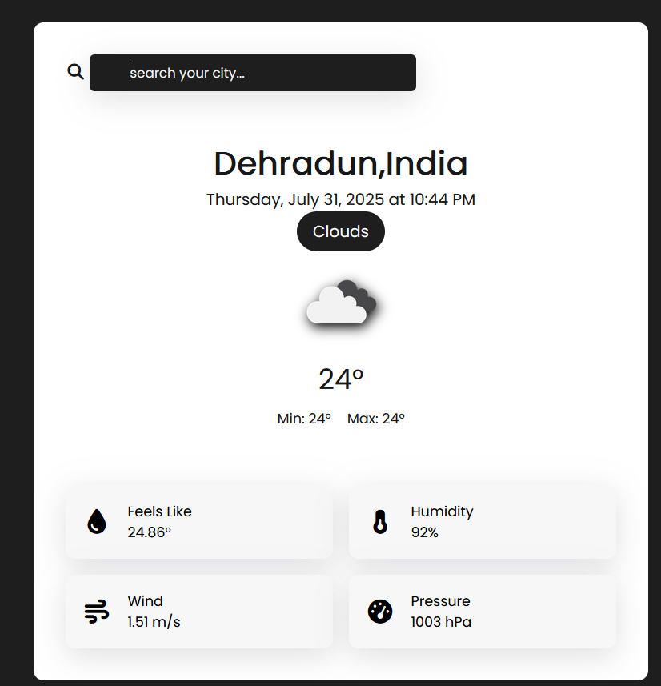

# live-weather-forecast

A modern and responsive weather forecast web app built using **HTML**, **CSS**, and **JavaScript**. It fetches real-time weather data using the **OpenWeatherMap API** and displays information like temperature, humidity, wind, and more — all styled in a sleek card-based UI.

---

## 🔍 Features

- 🌐 Search weather by city name
- 🌡️ Shows current temperature (°C), min/max, and feels-like
- 💧 Displays humidity, pressure, and wind speed
- 📅 Live date and time display
- 🌤️ Dynamic weather icons from OpenWeatherMap
- 🎨 Modern and responsive user interface

---

## 🛠️ Tech Stack

- HTML5
- CSS3
- JavaScript (Vanilla JS)
- OpenWeatherMap API

---

## 📸 Screenshots



---

## 🚀 How to Use

### ✅ Clone and Run Locally
```bash
git clone https://github.com/abhishekmatwan/weather-app-ui.git
cd weather-app-ui
